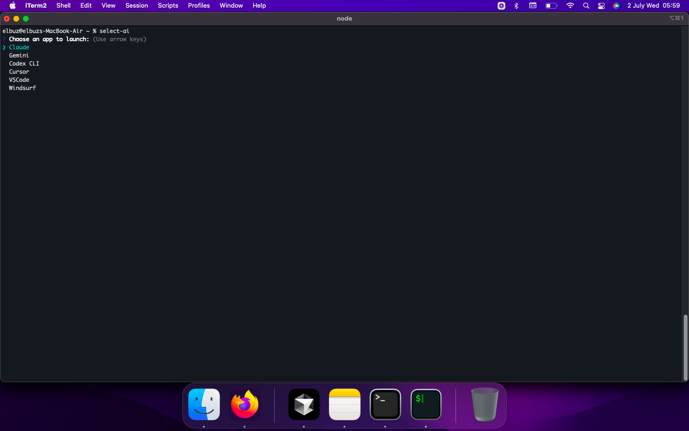

<p align="center">
  
</p>

<p align="center">
  
</p>


# select-ai

A simple command-line tool to quickly launch your favorite AI assistants and code editors.

## Features

- Interactive prompt to choose from a list of applications.
- Checks if an application is installed before attempting to launch.
- For command-line tools (like AI assistants), it offers to install them if they are not found.
- For GUI applications (like code editors), it provides the download link if they are not found in the standard `/Applications` directory.

## Supported Applications

- **AI Assistants (CLI):**
  - Gemini
  - Claude
- **Code Editors (GUI):**
  - Visual Studio Code
  - Cursor
  - Windsurf (Example)

## Installation

To use this tool, you can install it globally via npm:

```bash
npm install -g select-ai
```

or

```bash
sudo npm install -g select-ai
```

This will install the package from your local source code and make the `select-ai` command available in your terminal.

## Usage

Simply run the command:

```bash
select-ai
```

This will open an interactive menu. Use the arrow keys to navigate and press Enter to select and launch an application.
